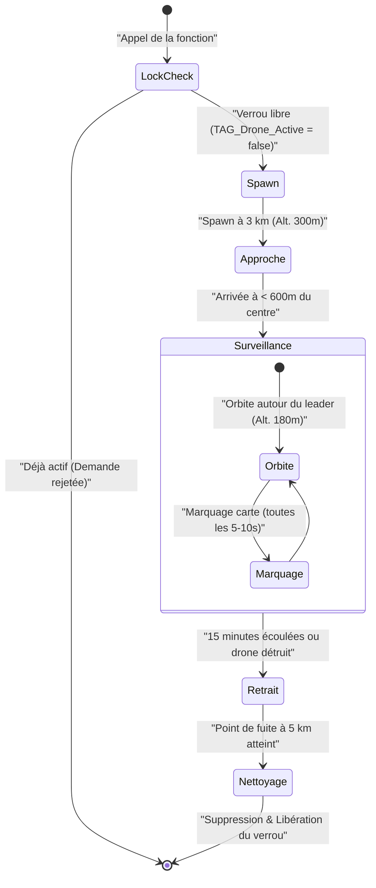

# Logique du Drone de Surveillance (MQ-9)

Ce document décrit en détail le fonctionnement et le cycle de vie du drone de surveillance déployé via la fonction [fn_requestDrone.sqf](file:///c:/Users/kevin/Documents/Arma%203/missions/Unstable.porto/functions/fn_requestDrone.sqf).

---

## 🗺️ Logique Globale & Cycle de vie

Le script est exécuté exclusivement côté serveur. Il gère l'apparition, le comportement en vol, la mise à jour des marqueurs de carte et la disparition du drone de surveillance de type **MQ-9 Reaper**.

---

## 🚀 1. Logique d'Apparition (Spawning)

1. **Sécurité contre les doublons (Verrou)** :
   - La variable globale `TAG_Drone_Active` dans le `missionNamespace` sert de verrou unique.
   - Si elle est à `true`, la demande est rejetée pour éviter d'avoir plusieurs drones en même temps sur la zone de combat.
2. **Calcul de la position de départ** :
   - Le script calcule le centre de masse (la position moyenne) de tous les joueurs en vie.
   - Le drone est créé à **3 000 mètres** de ce centre dans une direction aléatoire (`random 360`).
3. **Paramètres de vol initiaux** :
   - **Type de drone** : `CUP_B_USMC_DYN_MQ9` (Reaper USMC).
   - **Altitude de spawn** : **300 mètres** (`_approachHeight`).
   - **Vitesse initiale** : **55 m/s (~198 km/h)**. C'est une étape indispensable pour éviter que le drone (qui est un appareil à voilure fixe) ne décroche et ne s'écrase immédiatement après sa création.
   - **Orientation** : Dirigé vers la position centrale des joueurs.
4. **Configuration de l'équipage IA** :
   - Un équipage natif (pilote + opérateur tourelle) est généré via `createVehicleCrew`.
   - L'équipage et le drone sont configurés en **invulnérables** (`allowDamage false`).
   - Le mécanisme de fatigue par suppression de l'IA est désactivé (`disableAI "SUPPRESSION"`).

---

## 📏 2. Distances et Altitudes de Vol

Le drone utilise plusieurs seuils de distances et d'altitudes pour son comportement de vol et de détection :

| Paramètre | Valeur | Description |
| :--- | :--- | :--- |
| **Distance de spawn** | `3 000 m` | Distance de création du drone par rapport au centre des joueurs. |
| **Altitude d'approche** | `300 m` | Altitude à laquelle le drone navigue pour entrer et sortir de la zone. |
| **Altitude de surveillance** | `180 m` | Altitude de loiter (orbite) une fois arrivé sur zone. |
| **Rayon de Loiter (Orbite)** | `600 m` | Rayon du cercle que le drone décrit autour de sa cible de patrouille. |
| **Rayon de scan** | `1 500 m` | Rayon maximal de détection des unités autour du leader pour le marquage. |
| **Distance de sortie** | `5 000 m` | Distance de fuite du drone à la fin de sa mission. |
| **Seuil de nettoyage** | `< 1 000 m` | Le drone est supprimé lorsqu'il arrive à moins de 1 km de sa destination de fuite. |

---

## ⚙️ 3. Actions du Drone & Comportements

Le drone remplit deux rôles principaux : **le combat contre les véhicules ennemis** et **la surveillance cartographique**.

### ⚔️ Comportement au Combat et Renseignement
* **Engagement sélectif (Véhicules uniquement)** :
  * Le groupe du drone est paramétré en mode combat `RED` ("Fire at will").
  * Cependant, un gestionnaire d'événements (`EnemyDetected`) filtre les cibles : si l'entité détectée est de type humain (`Man`), le drone l'oublie immédiatement (`forgetTarget`). Le drone n'attaquera donc **que les véhicules terrestres ennemis**.
* **Furtivité face à l'infanterie ennemie** :
  * Une boucle parallèle force toutes les unités ennemies (`east`) à oublier régulièrement le drone (`forgetTarget _drone`) toutes les 4 secondes. Ainsi, l'infanterie OPFOR ignore totalement la présence du drone.

### 🗺️ Système de Marquage sur la Carte
* **Pools de marqueurs** : Le script pré-crée un pool fixe de 25 marqueurs rouges (OPFOR) et 25 marqueurs bleus (Alliés RACS - INDEP) au démarrage.
* **Rafraîchissement** : Toutes les **5 à 10 secondes**, le drone actualise la position des marqueurs dans le rayon de scan (`1 500 m` autour du leader du groupe appelant).
* **Simulation d'erreur (Bruit radar)** :
  * **OPFOR (Rouge)** : Un décalage aléatoire de ±25 mètres est appliqué aux coordonnées de chaque unité ennemie pour simuler un capteur satellite/FLIR imparfait.
  * **Alliés (Bleu)** : Leurs positions sont précises et sans bruit pour éviter les tirs fratricides.

---

## ❌ 4. Disparition du Drone (Despawn & Nettoyage)

Le drone quitte la zone et libère les ressources dans deux cas :
1. **Fin du temps de mission** : Le drone a patrouillé pendant **15 minutes** (900 secondes).
2. **Destruction du drone** : Bien que configuré en `allowDamage false` par défaut, le script gère sa destruction potentielle (`!alive _drone`) pour éviter de bloquer le système.

### Processus de retrait et de nettoyage :
1. **Notification** : Les joueurs reçoivent un message système indiquant la fin de la mission du drone.
2. **Vol de fuite (si vivant)** :
   * Le drone remonte à l'altitude d'approche de **300 m**.
   * Les waypoints de patrouille sont effacés.
   * Un nouveau waypoint est créé à **5 000 mètres** dans une direction aléatoire.
   * Le drone s'y dirige à vitesse maximale (`FULL`).
   * Le script attend que le drone arrive à moins de 1 000 m de cette position éloignée.
3. **Nettoyage final** :
   * Suppression de tous les marqueurs créés sur la carte (`deleteMarker`).
   * Suppression de l'équipage IA (`deleteVehicle`).
   * Suppression du véhicule drone (`deleteVehicle`).
   * Suppression du groupe IA pour éviter les groupes vides résiduels (`deleteGroup`).
   * **Libération du verrou** : La variable globale `TAG_Drone_Active` repasse à `false`, rendant possible un nouvel appel de drone.
