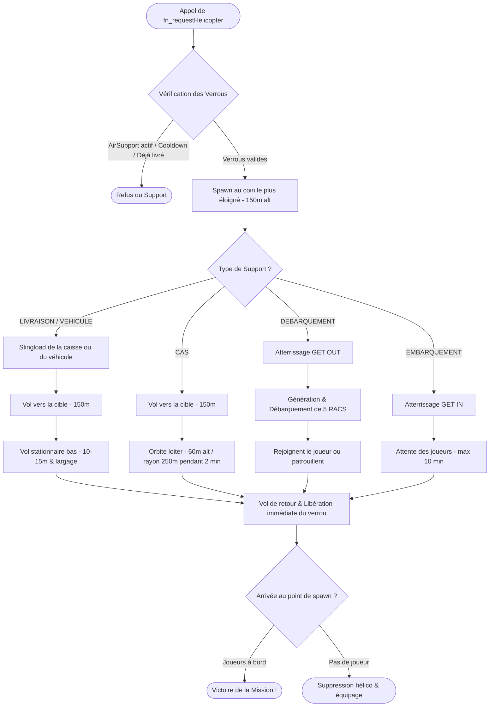

# Logique du Support Hélicoptère (CH-47 Chinook)

Ce document décrit en détail le fonctionnement, les algorithmes de vol, et les différents types de tâches gérés par la fonction [fn_requestHelicopter.sqf](file:///c:/Users/kevin/Documents/Arma%203/missions/Unstable.porto/functions/fn_requestHelicopter.sqf).

---

## 🗺️ Logique Globale & Processus de Décision

La fonction s'exécute côté serveur. Elle gère le cycle de vie complet d'un hélicoptère lourd **CH-47 Chinook** (`CUP_B_MH47E_USA`) selon 5 types de missions.

---

## 🚀 1. Logique d'Apparition (Spawning)

1. **Vérification des Verrous (Concurrency)** :
   * **Verrou aérien** : La variable globale `TAG_AirSupport_Active` empêche deux hélicoptères de support simultanés.
   * **Limitation véhicule** : Le type `VEHICULE` (remplacement) ne peut être livré **qu'une seule fois dans la partie** via la variable `TAG_VehicleSupport_Delivered`. L'interaction `AddAction` associée est également supprimée sur tous les clients.
   * **Cooldown CAS** : Un délai de 5 minutes (`TAG_CAS_Cooldown_Until`) doit s'écouler entre deux missions d'appui aérien (CAS).
2. **Choix du point de spawn (Sécurisation des trajectoires)** :
   * La carte de Porto mesurant 5,1 km x 5,1 km, le script définit les 4 coins de la carte (positionnés sur l'eau à 200 m des bords pour éviter toute collision) :
     * **Sud-Ouest** : `[200, 200]`
     * **Nord-Ouest** : `[200, 4920]`
     * **Nord-Est** : `[4920, 4920]`
     * **Sud-Est** : `[4920, 200]`
   * Il calcule les distances par rapport à l'héliport de destination et sélectionne le **coin le plus éloigné** pour faire apparaître l'hélicoptère (ce qui garantit une trajectoire d'approche propre et progressive).
3. **Spawn & Invulnérabilité** :
   * L'hélicoptère est créé à l'altitude d'approche de **150 m**.
   * L'hélicoptère et l'équipage IA (pilote, copilote et artilleurs) sont configurés en **invulnérables** (`allowDamage false`) pour éviter les accidents de pilotage automatique.
   * Les unités d'équipage appartiennent à la faction du joueur (RACS si indépendant, BLUFOR si BLUFOR). Leurs scripts FSM sont désactivés pour optimiser le comportement de vol.

---

## 📏 2. Distances et Altitudes de Vol

Le Chinook adapte son altitude et ses distances selon le type de mission demandée :

| Paramètre | Valeur | Description |
| :--- | :--- | :--- |
| **Altitude d'approche/retrait** | `150 m` | Altitude de transit sécurisée au-dessus de la terre ferme. |
| **Altitude stationnaire (Slingload)** | `10 m` / `15 m` | `15 m` pour les munitions, `10 m` pour le véhicule pour un largage propre. |
| **Hauteur max de décrochement** | `< 3 m` | Le câble est détaché dès que le colis est à moins de 3 m du sol. |
| **Altitude CAS (Loiter)** | `60 m` | Altitude d'orbite de tir pour les mitrailleurs latéraux. |
| **Rayon de loiter CAS** | `250 m` | Rayon du cercle d'orbite pendant l'appui aérien. |
| **Distance d'arrêt** | `< 200 m` | Rayon d'approche final avant de passer en vol stationnaire ou en atterrissage. |

---

## ⚙️ 3. Actions & Types de Missions de l'Hélicoptère

L'hélicoptère exécute l'une des cinq tâches définies par le paramètre `_supportType` :

### A. 📦 LIVRAISON (Largage de caisse de munitions)
* L'hélicoptère transporte sous élingue (slingload) une caisse de ravitaillement (`B_supplyCrate_F`). La caisse est allégée temporairement (500 kg) pour la stabilité du vol.
* **Contenu dynamique** : Le script extrait l'équipement initial des joueurs enregistrés (Armes principales, secondaires, chargeurs, objets, sacs à dos) et remplit la caisse en conséquence, en ajoutant des kits de soins, grenades et fumigènes.
* Une fois le stationnaire établi, la caisse descend progressivement. Dès qu'elle touche le sol (ou passe sous 3 m), le câble est détaché, la masse d'origine de la caisse est rétablie et elle devient vulnérable.
* Un fumigène vert est déclenché sur la caisse. **Nettoyage automatique** : après 10 minutes, la caisse s'auto-détruit après avoir émis des fumigènes blancs de fin de vie.
* Un marqueur de carte bleu "Drop Logistique" est affiché pendant 2 minutes.

### B. 🚗 VEHICULE (Remplacement de véhicule perdu)
* Processus identique à la livraison, mais le colis est le véhicule de l'équipe (par défaut un Humvee lourd armé `CUP_B_nM1025_SOV_M2_USMC_DES`).
* Le poids sous élingue est stabilisé à 800 kg.
* Après largage, le véhicule est stocké dans la variable globale `vehicule_team` pour les joueurs. C'est une livraison unique par partie.

### C. 🎯 CAS (Appui Aérien Rapproché)
* L'hélicoptère orbite à **60 m** d'altitude avec un rayon de **250 m** autour de la position cible.
* Le support dure **2 minutes** (120 s).
* Toutes les 5 secondes, le script détecte et révèle automatiquement (`reveal`) toutes les unités OPFOR (`east`) dans un rayon de 500 m à l'équipage pour que les artilleurs latéraux ouvrent le feu à vue.

### D. 🪖 DEBARQUEMENT (Renforts d'Infanterie alliée)
* L'hélicoptère atterrit au sol (`land "GET OUT"`).
* Génère un groupe de 5 soldats RACS (Chef de groupe, Médic, Mitrailleur, Anti-char, Fusilier).
* Leurs équipements (vestes, casques, lunettes, uniformes) sont sélectionnés de manière premium et leurs identités (voix, visages et noms turcs, arabes, africains ou indonésiens) sont configurées de façon cohérente avec le système général de la mission.
* Dès leur sortie de l'hélicoptère, si le groupe du joueur appelant est actif, ils **rejoignent son groupe** (`joinSilent`). Sinon, ils patrouillent de façon autonome sur zone.

### E. 🚪 EMBARQUEMENT (Extraction / Otage)
* L'hélicoptère atterrit au sol (`land "GET IN"`).
* Il attend que **tous les joueurs humains vivants** soient montés à bord.
* Si aucun joueur ne monte à bord au bout de **10 minutes** (timeout de 600 s), l'hélicoptère repart.

---

## ❌ 4. Disparition de l'Hélicoptère (RTB & Despawn)

Une fois sa mission accomplie :
1. **Vol de retour** : L'hélicoptère reprend son altitude d'approche (**150 m**) et fait route vers le point de spawn d'origine (sur l'eau).
2. **Libération anticipée du verrou** : La variable `TAG_AirSupport_Active` est réinitialisée à `false` **dès le début du trajet de retour**, permettant aux joueurs de demander d'autres appuis (ex. un drone) sans attendre que le Chinook soit totalement sorti de la carte.
3. **Condition de Victoire** : 
   * Si l'hélicoptère atteint le point de spawn avec des joueurs humains à bord, le script déclenche la victoire et termine la mission (`BIS_fnc_endMission`).
4. **Nettoyage** :
   * Si l'hélicoptère revient à vide, le véhicule, son groupe IA et son équipage sont détruits de la mémoire du serveur (`deleteVehicle` / `deleteGroup`) afin de libérer les ressources système.
   * Si le support était un CAS, le cooldown est alors enclenché pour 5 minutes.
