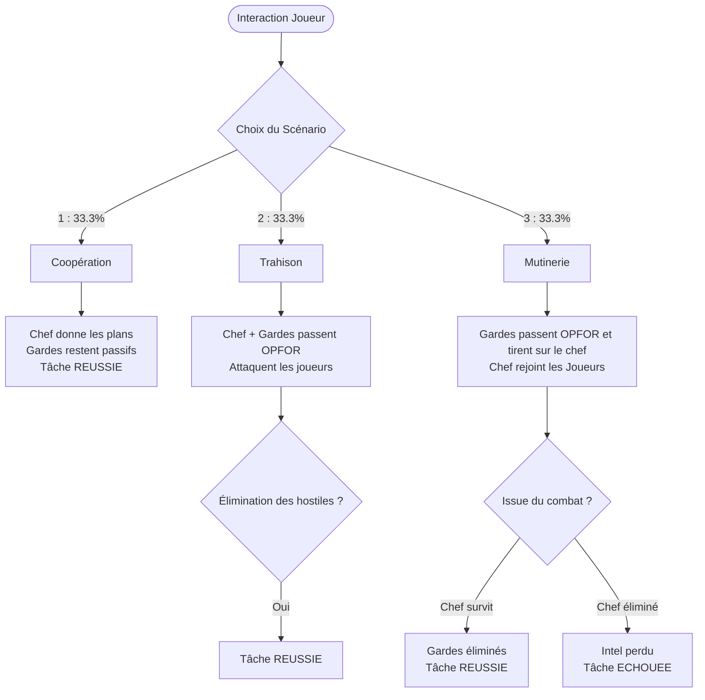

# Documentation Logique de la Tâche 01 (TASK01)

Ce document détaille le fonctionnement interne de la tâche **01 (Rendez-vous de reconnaissance)**, son initialisation, le spawn de ses unités, le système d'interaction et les scénarios de branchement aléatoires.

---

## 1. Initialisation et Positionnement Dynamique
Le script principal **[tasks/fn_task01.sqf](file:///c:/Users/kevin/Documents/Arma%203/missions/Unstable.porto/tasks/fn_task01.sqf)** s'exécute côté serveur (`isServer`) et effectue les étapes suivantes pour déterminer le point de rendez-vous :

1. **Recherche de Logiques d'Éditeur** :
   - Recherche toutes les variables globales commençant par `M_Dans_Bat_` (JAMAIS a moins de 100 mettres d'un joueur du serveur.).
   - Sélectionne une logique aléatoirement si plusieurs existent .(JAMAIS a moins de 250 mettres d'un joueur du serveur.).
   - Ajoute `+0.2m` sur l'axe Z par rapport à la position de la logique de jeu pour éviter que l'officier ne traverse le plancher ou ne clip dans des objets.
2. **Fallback Dynamique** :
   - Si aucune logique `M_Dans_Bat_` n'est détectée dans l'éditeur, le script recherche le bâtiment le plus proche ("House", "Building", "Church", etc.) dans un rayon progressif (de 250 à 1000m) autour du leader des joueurs.
3. **Fallback Statique** :
   - En dernier recours, si aucun bâtiment n'est trouvé, le rendez-vous est placé aux coordonnées statiques `[2300, 2300, 0.2]`.

La position retenue est enregistrée dans la variable publique `LL_g_usedTaskPos` afin d'éviter que de futures tâches ne se chevauchent sur la même position.

---

## 2. Spawn des Unités et Comportement Initial

### Le Chef de Milice (`I_G_officer_F`)
- Spawn au point de rencontre au sein du groupe `independent`.
- Ses déplacements (`MOVE`) et animations automatiques (`ANIM`) sont désactivés pour qu'il reste à son poste de négociation.
- Le Chef de milice doit se tourner toutes les 2 secondes vers la position du joueur du serveur le plus proches
- Il est configuré en mode debout (`setUnitPos "UP"`) et joue en boucle l'animation de discussion civil `"Acts_CivilTalking_1"` (renouvelée via un Event Handler `AnimDone`).
- Son état initial est configuré sur `"WAIT"`.
- Son apparence (vêtements civils) est appliquée via `LL_fnc_applyCivilianTemplate`.

### Les Gardes du Corps (`I_G_Soldier_F`)
- Spawn de **2 à 4 gardes** dans un rayon de 6 à 20 mètres autour du chef de milice.
- Leur apparence et leur armement de milicien sont appliqués via `LL_fnc_applyCivilianTemplate`.
- **Patrouille active** : Chaque garde exécute une routine de patrouille en boucle (`doMove`) qui le déplace lentement (`LIMITED`) d'un point à un autre autour du bâtiment. Ils restent en mode pacifique (`SAFE` / `BLUE`) tant qu'aucun combat n'a éclaté.

---

## 3. Interaction et Déclenchement
L'action est partagée avec les joueurs via le script **[tasks/fn_task01_addAction.sqf](file:///c:/Users/kevin/Documents/Arma%203/missions/Unstable.porto/tasks/fn_task01_addAction.sqf)** :
- L'action contextuelle `"Parler au chef de milice"` est ajoutée via `addAction` sur le chef de milice pour chaque client.
- Pour éviter les doubles déclenchements en multijoueur (si deux joueurs interagissent simultanément), la variable globale `LL_Task01_Triggered` passe immédiatement à `true` sur l'ensemble du réseau.
- Le client supprime l'action et demande au serveur (`remoteExec ["LL_fnc_task01", 2]`) d'exécuter la phase de scénario.

---

## 4. Logiques de Probabilités et Scénarios
Dès que l'interaction est enclenchée, le serveur tire au sort un nombre de 1 à 3 (chacun ayant **33.3% de chance** de se produire) :

### Détail des Embranchements

| Scénario | Nom | Déroulement & Logique Scriptée | Issue de la Tâche |
| :--- | :--- | :--- | :--- |
| **Scénario 1** | **Coopération** | - Dialogue sous-titré : le chef donne les positions et plans ennemis. - Les gardes désactivent leurs déplacements et restent pacifiques. | **RÉUSSIE** (immédiatement). |
A la fin du Scénario 1 le groupe se rejoint et ils partent loin vers une M_Dans_Bat_XXX a plus de 1000m des joueurs du serveur (vérifier toutes les 60 seondes la distance) Lorsqu'ils sont a plus de 1500m des joueurs, ils disparaissent.
| **Scénario 2** | **Trahison** | - Dialogue sous-titré provocateur. - Le chef et ses gardes rejoignent la faction `east` (OPFOR) et attaquent les joueurs. - Ils tentent de faire feu en priorité sur les joueurs à proximité. | **RÉUSSIE** une fois que le chef et tous ses gardes ont été éliminés. |
Les traitres doivent se diriger vers les joueurs du serveurs les plus proches. Ils cherchent et fouillent pour les tuer.
| **Scénario 3** | **Mutinerie** | - Dialogue sous-titré : le chef est allié mais ses gardes le traitent de traître. - Les gardes rejoignent la faction `east` (OPFOR) et tirent immédiatement sur le chef de milice. - Le chef rejoint le groupe des joueurs (Indépendants) et tente de se défendre. | - **RÉUSSIE** si tous les gardes mutins meurent et que le chef survit. - **ÉCHOUÉE** si le chef meurt sous les balles des mutins ou des joueurs. |
Les Mutins doivent se diriger vers les joueurs du serveurs les plus proches. Ils cherchent et fouillent pour les tuer.

---

## 5. Cas Particuliers et Optimisations

### Mort Prématurée du Chef de Milice
Si le chef de milice est tué par des joueurs ou par des éléments extérieurs *avant* que l'interaction n'ait été initiée :
- La tâche échoue instantanément (`task_01_recon` passe à l'état `FAILED`).
- Le marqueur de la carte est immédiatement supprimé.
- Les gardes doivent immédiatement se diriger vers les joueurs du serveurs les plus proches. Ils cherchent et fouillent pour les tuer.

### Nettoyage de Zone (Garbage Collector)
Une fois la tâche complétée (qu'elle soit réussie ou échouée) :
- Le script attend que tous les joueurs en vie s'éloignent de plus de **1500 mètres** de la zone du rendez-vous.
- Une fois cette distance atteinte, tous les corps et unités encore présents (chef de milice et ses gardes, vivants ou morts) sont supprimés de la mémoire du serveur (`deleteVehicle`) pour économiser des ressources processeur.
