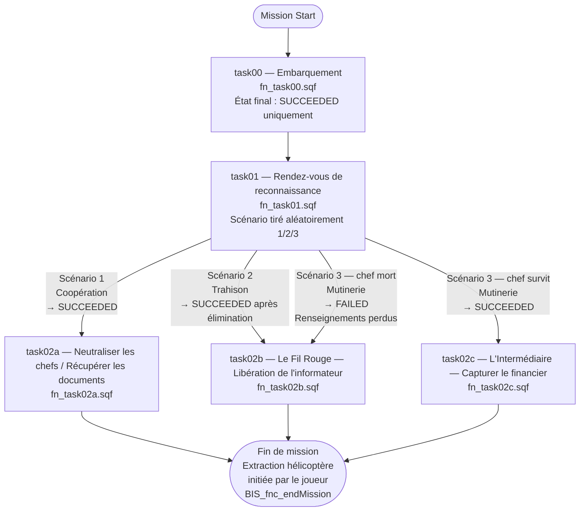

# TASK_TREE.md — Arbre de mission

Ce fichier est la référence de l'enchaînement des tâches.  
Toujours le mettre à jour avant de coder une nouvelle tâche.

---

## Arbre complet

---

## Détail par tâche

| ID | Fichier | Déclencheur | Issues | Tâche suivante |
|---|---|---|---|---|
| `task00` | `fn_task00.sqf` | `fn_taskManager.sqf` au lancement | `SUCCEEDED` uniquement | `task01` |
| `task01` | `fn_task01.sqf` | Après `task00 SUCCEEDED` | `SUCCEEDED` (S1, S2, S3-chef-vivant) / `FAILED` (S3-chef-mort) | S1→`task02a` / S2→`task02b` / S3-vivant→`task02c` / S3-mort→`task02b` |
| `task02a` | `fn_task02a.sqf` | `LL_g_task01_scenario == 1` (Coopération) | `SUCCEEDED` (documents récupérés) | Extraction |
| `task02b` | `fn_task02b.sqf` | Trahison **ou** Mutinerie chef mort | `SUCCEEDED` (informateur libéré) / `FAILED` (tué) | Extraction |
| `task02c` | `fn_task02c.sqf` | `LL_g_task01_scenario == 3` + chef vivant (Mutinerie réussie) | `SUCCEEDED` (intermédiaire capturé) / `FAILED` (tué) | Extraction |

---

## Variable de branchement

`LL_g_task01_scenario` (missionNamespace, public) — définie dans `fn_task01.sqf` lors du déclenchement du scénario.

| Valeur | Scénario |
|---|---|
| `1` | Coopération |
| `2` | Trahison |
| `3` | Mutinerie |

---

## Règle de fin de mission

**Aucune tâche ne déclenche `BIS_fnc_endMission`.**  
La fin de mission est exclusivement initiée par le joueur via l'action `[Hélicoptère] Demander Extraction` (TASK_RULES §7).

---

## Changelog

| Date | Modification |
|---|---|
| 2026-05-25 | Création — task00 + task01 documentées, placeholders task04a/b/c |
